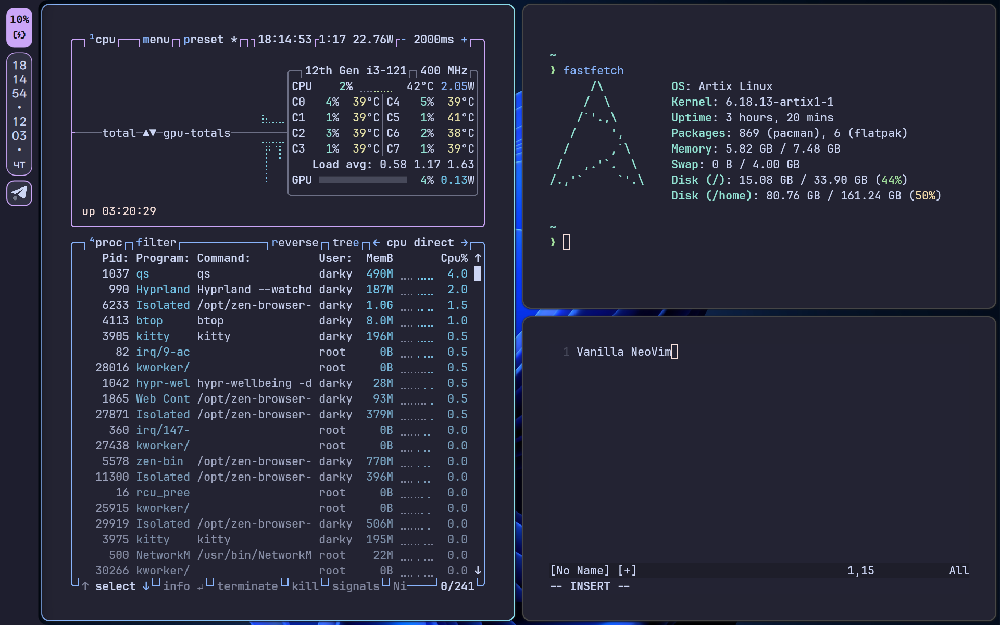

# ✅ Installation

## Just clone and copy to ~/.config
```bash
git clone --recurse-submodules https://github.com/darkydtm/nameless-dots && cd nameless-dots && cp -r * ~/.config/
```

## 📸 Screenshot


# ⌨️ Keybindings

## Workspaces

| Hotkey | Action |
|--------|--------|
| `Super + 1..9` | Switch to workspace 1–9 |
| `Super + S` | Toggle special workspace |
| `Super + Ctrl + ←` | Switch to previous workspace |
| `Super + Ctrl + →` | Switch to next workspace |

## Window Management

| Hotkey | Action |
|--------|--------|
| `Super + Q` | Close active window |
| `Super + F` | Fullscreen |
| `Super + D` | Maximize |
| `Super + Alt + Space` | Toggle floating |
| `Super + Ctrl + Z` | Force kill active window |
| `Super + Ctrl + Shift + Z` | Freeze active window |
| `Super + LMB` | Move window |
| `Super + RMB` | Resize window |

## Move Window

| Hotkey | Action |
|--------|--------|
| `Super + Shift + ←/→/↑/↓` | Move window in direction |
| `Super + Alt + 1..9` | Move window to workspace 1–9 |
| `Super + Alt + S` | Move window to special workspace (silent) |
| `Super + Ctrl + Shift + ←` | Move window to previous workspace |
| `Super + Ctrl + Shift + →` | Move window to next workspace |

## Focus

| Hotkey | Action |
|--------|--------|
| `Super + ←/→/↑/↓` | Move focus in direction |

## Resize Window

| Hotkey | Action |
|--------|--------|
| `Super + Alt + ←` | Shrink horizontally |
| `Super + Alt + →` | Grow horizontally |
| `Super + Alt + ↑` | Shrink vertically |
| `Super + Alt + ↓` | Grow vertically |

## Applications

| Hotkey | Action |
|--------|--------|
| `Super + Return` | Terminal (kitty) |
| `Super + E` | File manager (Nautilus) |
| `Super + T` | Telegram (AyuGram) |
| `Super + Ctrl + W` | Browser (Zen) |
| `Ctrl + Shift + Esc` | Task manager (Mission Center) |

## Quickshell

| Hotkey | Action |
|--------|--------|
| `Super + .` | Emoji picker |
| `Super + V` | Clipboard |
| `XF86Tools` | Toggle launcher |
| `Super + Alt + /` | Toggle launcher |
| `Ctrl + Alt + Del` | Session menu |
| `Super + Ctrl + R` | Restart Quickshell |

## Media & Volume

| Hotkey | Action |
|--------|--------|
| `Super + M` | Play / Pause |
| `XF86AudioRaiseVolume` | Volume +5% |
| `XF86AudioLowerVolume` | Volume −5% |
| `XF86AudioMute` | Mute (set to 0) |
| `XF86AudioMicMute` | Mute microphone |

## Screenshot & Recording

| Hotkey | Action |
|--------|--------|
| `Super + Shift + S` | Screenshot — select area |
| `Print` | Screenshot — full screen |
| `Super + Alt + R` | Record screen with sound |
| `Super + Shift + Alt + R` | Record fullscreen with sound |

## Zoom

| Hotkey | Action |
|--------|--------|
| `Super + Ctrl + =` | Zoom in (+0.25) |
| `Super + Ctrl + -` | Zoom out (−0.25) |
| `Super + Ctrl + \` | Reset zoom |

## Display & Session

| Hotkey | Action |
|--------|--------|
| `Super + Ctrl + A` | Toggle display (DPMS) |
| `Super + Ctrl + S` | Suspend |
| `Super + Ctrl + F` | Power off |

## Misc

| Hotkey | Action |
|--------|--------|
| `Super + Shift + P` | Color picker (hyprpicker) |
| `Super + Space` | Switch keyboard layout |
